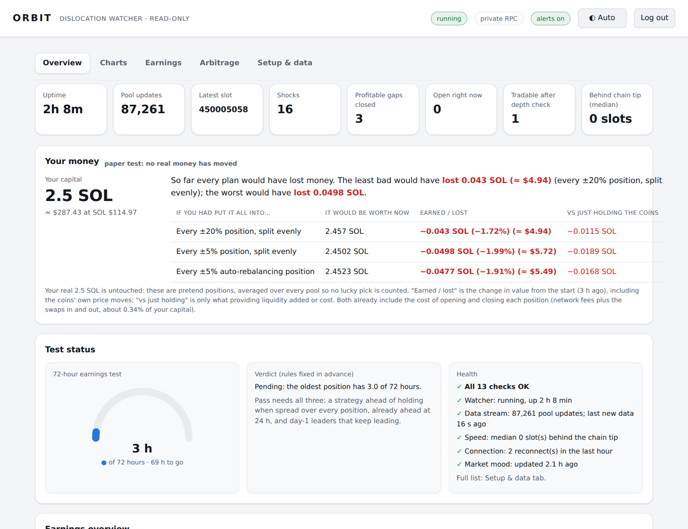
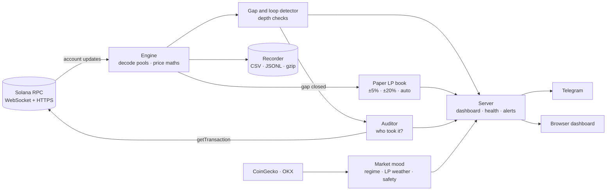
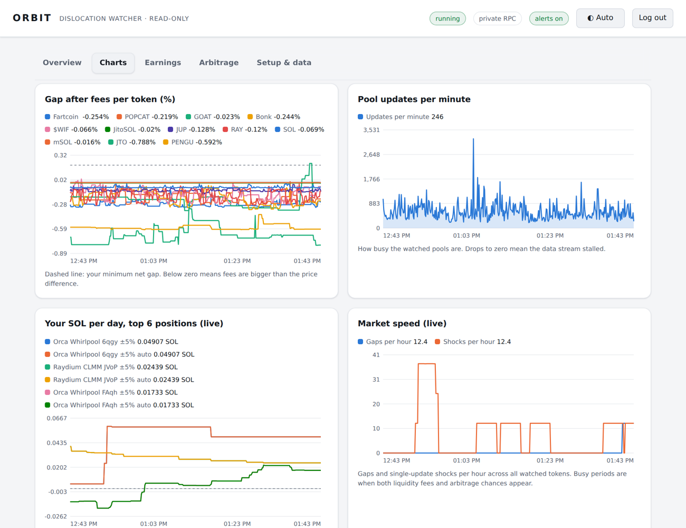

<div align="center">

# 🛰️ ORBIT

**A read-only Solana DEX observatory that measures, with on-chain data, whether "free money" strategies actually pay.**


[What it found](#-what-it-found) · [Features](#-features) · [Architecture](#-architecture) · [Quick start](#-quick-start) · [Deploy](#-deploy-in-10-minutes) · [Full guide](GUIDE.md)



</div>

---

## Why

Social media is full of claims like *"my Solana arbitrage bot prints money every day"*. Orbit was built to test those claims with data instead of opinion.

It streams live pool state from the chain, re-computes every price from raw account bytes, and records what really happens: how big each price gap is after fees, how fast it closes, **who closes it and what they paid**, and whether providing liquidity beats simply holding the coins.

> **It never trades.** No wallet, no signing, no transaction sending, no private keys. A unit test fails the build if trading code ever appears.

## 📊 What it found

Results from the author's own runs (about 46 hours, 4 million pool updates, 12 tokens):

| Question | Answer from the data |
|---|---|
| Are there price gaps between Solana DEXes? | **Yes.** 660 gaps that were profitable after fees. |
| Can a normal setup catch them? | **No.** 54% closed within **one slot (0.4 s)**, 61% within two. |
| Who closes them? | Arbitrage bots trading both pools in **one atomic transaction**, often paying tiny or no Jito tips. |
| Triangle loops (SOL→token→USDC→SOL)? | 13 profitable loops seen, and **every one closed within 1 slot**. Best was +0.074 SOL, gone in 0.19 s. |
| Is Orbit's price maths right? | **Yes.** 4,035 real swaps re-priced from the pool state just before them: **100% within 0.1%**. |
| Does providing liquidity beat holding? | First day: spread across every pool, **−1.95%** (±5% ranges) and **−0.54%** (±20% ranges). One token (WIF) won everywhere, but nothing predicted it in advance. The 72-hour verdict is judged by rules fixed in advance and is still running. |

**Bottom line so far:** the gaps are real, but they belong to co-located, Rust-based searchers with sub-100 ms pipelines. A home setup watches them close.

## ✨ Features

**Market microstructure**
- ⚡ Live WebSocket account streaming at `processed` commitment, with latency to the chain tip measured every slot
- 🧮 Exact swap maths for **Raydium AMM v4, Raydium CPMM, PumpSwap**; price and live fees for **Orca Whirlpool, Raydium CLMM, Meteora DLMM and DAMM v2**
- 📏 Depth checks: simulated 0.25 / 1 / 2.5 SOL round trips, not just top-of-book prices
- 🔺 Triangle-loop detection across SOL and USDC pools
- 🕵️ **Auditor**: finds the real transaction that closed each gap (winner, Jito tip, priority fee, programs used)
- ✅ **Reality check**: re-quotes real swaps from historical pool state to prove the maths
- 🆕 New-pool hunter that auto-watches fresh tokens for 30 minutes

**Liquidity-provider research**
- 💧 Paper CLMM positions in every pool: **±5%, ±20% and ±5% auto-rebalancing** (Hummingbot-style)
- 📈 Fees read from each pool's on-chain `fee_growth_global` counters, impermanent loss measured against holding
- ⚖️ A **"realistic result"** that averages every position, so no cherry-picked winners
- 🧪 **Pass/fail verdict rules written before the results**: beat holding, already ahead at 24 h, and day-1 leaders must keep leading

**Market context**
- 🌡️ Crypto regime score (0–100) from the MIT-licensed [crypto-regime-analyzer](https://github.com/tradermonty/claude-trading-skills) skill
- ☁️ **LP weather**: how often each token stayed inside ±5% / ±20% over 3 and 7 days of history
- 🛡️ **Token safety** read from the chain: mint/freeze authority, risky Token-2022 extensions, holder concentration

**Operations**
- 🩺 13 automatic health checks with Telegram alerts on failure and recovery
- 🗜️ Raw data rotated and gzipped every 6 h (about 7× smaller); automatic disk-space protection
- 📦 One-click **analysis bundle** with secrets masked
- 🔐 Password login, rate-limited, CSP with per-request nonces, same-origin API
- 🌓 Light and dark themes, five dashboard tabs, works on a phone

## 🏗️ Architecture



| File | Role |
|---|---|
| `watcher.py` | Pool decoders, pricing maths, engine, paper LP positions, auditor, recorder, report |
| `server.py` | Dashboard server, login, supervision, health checks, archives, alerts |
| `regime.py` · `regime_skill.py` | Market mood (the regime scoring is kept word for word from the original skill) |
| `dashboard.html` | Single-file UI: plain JavaScript and hand-drawn SVG charts, no frameworks |
| `test_*.py` | 125 offline tests, including fake Solana, CoinGecko and OKX servers |

**Design choices:** Python standard library only (nothing to `pip install`, a tiny attack surface), one process, state on a single volume, and every external call read-only.

## 🚀 Quick start

```sh
git clone https://github.com/effess96/orbit-watcher && cd orbit-watcher
export ADMIN_PASSWORD='choose-a-long-password'
python3 server.py          # open http://localhost:8080 and add a token mint
```

Command-line mode, without the dashboard:

```sh
python3 watcher.py discover <TOKEN_MINT>   # finds its supported pools and writes config.json
python3 watcher.py watch                   # streams and records
python3 watcher.py report                  # prints the findings
```

A free RPC key (Helius, QuickNode, Triton) is recommended for long runs: set `SOLANA_RPC_HTTP` and `SOLANA_RPC_WS`.

## ☁️ Deploy in 10 minutes

Runs 24/7 on [Railway](https://railway.app) using the included `Dockerfile` and `railway.json`, with a volume at `/data`. Step-by-step: **[DEPLOY.md](DEPLOY.md)**.

| Variable | Required | Purpose |
|---|---|---|
| `ADMIN_PASSWORD` | ✅ | Dashboard login, 12+ characters |
| `SOLANA_RPC_HTTP` / `SOLANA_RPC_WS` | recommended | Your own RPC endpoints |
| `TELEGRAM_BOT_TOKEN` / `TELEGRAM_CHAT_ID` | optional | Alerts, daily summary, trouble notices |
| `ORBIT_LP_CAPITAL_SOL` | optional | Capital used in the SOL-per-day figures (default 2.5) |

<div align="center"></div>

## 🧪 Tests

```sh
python3 -m unittest test_watcher test_server test_regime
```

125 tests, fully offline. They cover every pool decoder against real account layouts, fee-counter wrap-around guards, WebSocket reconnects, the auditor, verdict rules, health checks, disk trimming, login lockout and security headers, **and an assertion that no signing or sending code exists.**

## ⚠️ Honest limits

- Gaps that open and close inside a single slot are invisible to any account-streaming observer, so real competition is even faster than Orbit can show.
- Concentrated-liquidity depth uses a single-range approximation. Large trades that cross ticks are optimistic.
- Paper LP positions ignore the gas and rent of real positions and weather uses hourly prices. Real results will be a little worse.
- Nothing here is financial advice. It is a measuring instrument, and its main finding so far is that most "easy" strategies aren't.

## 🙏 Credits

- Regime scoring: [crypto-regime-analyzer](https://github.com/tradermonty/claude-trading-skills) by TraderMonty (MIT), embedded unchanged in `regime_skill.py`
- Rebalancing idea: [Hummingbot](https://hummingbot.org). Token-safety idea: sentry-bot.
- Pool layouts verified against the Orca, Raydium and Meteora open-source programs

## License

[MIT](LICENSE). Use it, fork it, and prove your own bot claims with data.
